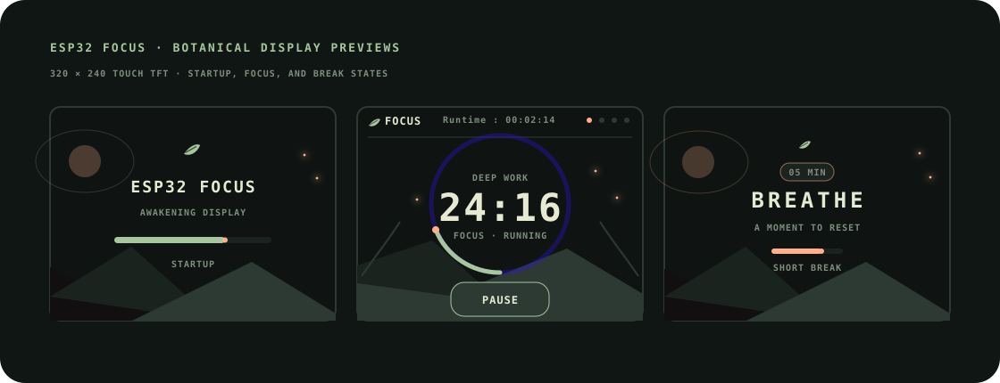

# esp32-focus

A polished, fully offline Pomodoro timer for an ESP32 with a 320×240 touch display. Its botanical interface combines a near-black landscape, desaturated greens, cream typography, a circular progress ring, and sparing peach accents with stable fixed-position countdown digits.

## Interface

- Startup opens with a calm botanical loading splash before revealing the timer.
- Focus, short-break, and long-break sessions each have a custom transition screen with a duration pill and restrained progress flourish.
- Layered hills, contour lines, foreground sprigs, and softly flickering fireflies give the scenery greater depth.
- Screen changes use a dark botanical veil and staged content reveal; four fireflies move around the upper progress circle, four more roam gently through the side scenery, and seven background lights softly flicker.
- A detailed laurel frame surrounds the timer, growing twelve paired botanical milestones from bottom to top with companion leaves, fine veins, peach buds, and a restrained glow.
- The thin circular ring begins empty and grows clockwise with elapsed time using flicker-free incremental updates.
- Changed countdown digits fade independently while unchanged digits remain stationary, with the complete timer kept inside the progress circle.
- Compact in-ring labels keep Focus, Break, running, resting, and paused states clear of the progress circle.
- The top bar shows `Runtime : HH:MM:SS`, the total uptime since the device booted.
- **Ready** shows a stable Start indicator, **Start** produces one short accent pulse, and **Paused** softly breathes the dimmed progress ring.
- Completion fills the ring, performs one bright sweep, then advances automatically.
- The four header dots show focus-cycle progress: green is complete, peach is current, and dim dots remain.

## Hardware

The project targets the locally verified **ESP32 Dev Module / ESP32-D0WD-V3** and **ILI9341 320×240 SPI TFT** with an **XPT2046 resistive touch panel**.

### Wiring

| Function | ESP32 GPIO |
| --- | ---: |
| TFT CS | 15 |
| TFT DC | 2 |
| TFT SCK | 14 |
| TFT MOSI | 13 |
| TFT MISO | 12 |
| TFT reset | Not connected (`-1`) |
| TFT backlight | 21 |
| Touch CS | 33 |
| Touch IRQ | 36 |
| Touch DIN | 32 |
| Touch MISO | 39 |
| Touch CLK | 25 |

The display runs in landscape rotation 1 over HSPI at 26 MHz. These values come from the known-working local ESP32 projects and are compiled into `platformio.ini`; no global TFT_eSPI configuration is required.

## Controls and behavior

- **START / PAUSE / RESUME** controls the current session.
- **RESET** restores the current session to its full duration.
- **NEXT** advances to the next session without auto-starting it.
- Focus sessions are 25 minutes, short breaks are 5 minutes, and every fourth focus is followed by a 15-minute long break.
- A completed session briefly shows **Session complete**, advances automatically, and starts the next session.
- The four dots at the top-right show progress through the current focus cycle.
- **Runtime** shows total elapsed time since boot in the top bar.

## Install, build, and flash

Prerequisites:

- A data-capable USB cable and permission to access the serial device (typically membership in the `dialout` group on Linux)
- [PlatformIO Core](https://docs.platformio.org/en/latest/core/installation/index.html)

```bash
git clone https://github.com/creamy-is-hacked/esp32-focus.git
cd esp32-focus
pio run
pio run --target upload
pio device monitor --baud 115200 --port /dev/ttyUSB1
```

This machine's verified ESP32 port is `/dev/ttyUSB1`; `/dev/ttyUSB0` belongs to a separate LED controller. On another machine, identify the ESP32 with `pio device list`, then change `upload_port` and `monitor_port` in `platformio.ini` or override them on the command line:

```bash
pio run --target upload --upload-port /dev/ttyUSB0
pio device monitor --baud 115200 --port /dev/ttyUSB0
```

## Configuration

Timer durations and the four-focus cycle are the constants near the top of `src/main.cpp`:

```cpp
constexpr uint8_t FOCUS_MINUTES = 25;
constexpr uint8_t SHORT_BREAK_MINUTES = 5;
constexpr uint8_t LONG_BREAK_MINUTES = 15;
constexpr uint8_t FOCUSES_PER_CYCLE = 4;
```

## Project structure

```text
esp32-focus/
├── platformio.ini  # board, library, pins, upload settings
├── src/main.cpp    # timer state machine, touch input, and UI
├── docs/screens.svg # visual screen previews
├── README.md
└── .gitignore
```

## Troubleshooting

- **Upload cannot connect:** confirm the ESP32 port with `pio device list`, close any serial monitor, and hold **BOOT** while the upload begins if automatic reset fails.
- **Permission denied:** add your user to `dialout` (`sudo usermod -aG dialout "$USER"`), then sign out and back in.
- **Blank but lit display:** recheck CS/DC/SCK/MOSI and confirm the ILI9341 controller. The supplied configuration expects the HSPI wiring above.
- **Touch is offset:** the included calibration matches this display in landscape rotation 1. Adjust the `200` and `3900` endpoints in `readTouch()` only after collecting raw corner readings.
- **Unstable upload at 921600 baud:** temporarily use `pio run --target upload --upload-port <port> --project-option "upload_speed=115200"`.

## Screen previews

The visual strip below represents the startup, focus, and break screens as rendered by the firmware.


